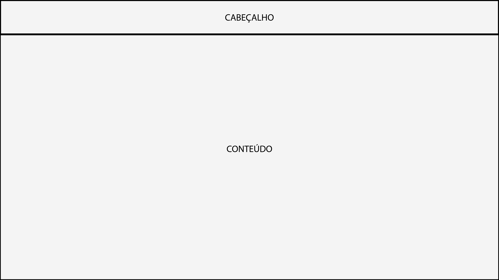

# Projeto de Interface

O projeto tem identidade visual padronizada entre as telas para facilitar a fluidez e navegabilidade do usuário, além disso, existe a intenção de seguir o padrão já adotado pelos principais sites de Streaming da atualidade, com o objetivo de alcançar um ambiente já conhecido e confortável para os usuários finais.

Tratando-se de um sistema que necessita do usuário para alcançar o objetivo desejado na correlação de títulos com preferências e possibilidade de personalização, nota-se a necessidade de participação do usuário ativamente na plataforma para obtermos o resultado desejado. Portanto, entende-se ser necessária a criação de cadastro / perfil de usuário.

## Fluxo do usuário (User Flow)

A Figura A abaixo apresenta o fluxo de navegação do usuário pelas telas do site proposto. Mais detalhes no wireframe interativo, em: [Marvel] https://marvelapp.com/whiteboard/AkRMLcgAiwuiBpcDas4w 

## Wireframes

Conforme mostra o fluxo de páginas do projeto, as telas apresentam entre si uma estrutura padrão que é apresentada a seguir. Nesta estrutura existem 2 grandes blocos que dividem a página, são eles:
**Cabeçalho** – local onde será disposto o logo do site e suas principais páginas.
**Conteúdo** – Local que apresentará, para cada tela, seu conteúdo personalizado.

A estrutura base das telas do projeto se mantém o mais simples e genérica o possível para mantermos a possibilidade de especificação de cada tela futuramente.

##Página de Cadastro

A página de cadastro será onde o usuário terá seu primeiro contato com a plataforma. Para evitar uma possível aparência contra-intuitiva nesta tela, o que poderia ocasionar em uma perda de interesse do usuário, esta página deverá apresentar uma aparência limpa, minimalista e intuitiva.

 

> **Links Úteis**:
> - [Protótipos vs Wireframes](https://www.nngroup.com/videos/prototypes-vs-wireframes-ux-projects/)
> - [Ferramentas de Wireframes](https://rockcontent.com/blog/wireframes/)
> - [MarvelApp](https://marvelapp.com/developers/documentation/tutorials/)
> - [Figma](https://www.figma.com/)
> - [Adobe XD](https://www.adobe.com/br/products/xd.html#scroll)
> - [Axure](https://www.axure.com/edu) (Licença Educacional)
> - [InvisionApp](https://www.invisionapp.com/) (Licença Educacional)

