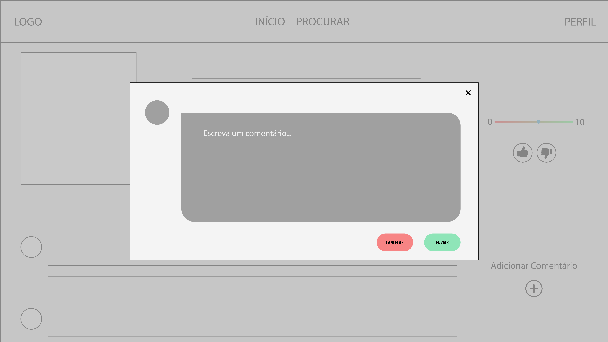

# Projeto de Interface

O projeto tem identidade visual padronizada entre as telas para facilitar a fluidez e navegabilidade do usuário, além disso, existe a intenção de seguir o padrão já adotado pelos principais sites de Streaming da atualidade, com o objetivo de alcançar um ambiente já conhecido e confortável para os usuários finais.

Tratando-se de um sistema que necessita do usuário para alcançar o objetivo desejado na correlação de títulos com preferências e possibilidade de personalização, nota-se a necessidade de participação do usuário ativamente na plataforma para obtermos o resultado desejado. Portanto, entende-se ser necessária a criação de cadastro / perfil de usuário.

## Fluxo do usuário (User Flow)

A Figura A abaixo apresenta o fluxo de navegação do usuário pelas telas do site proposto. Mais detalhes no wireframe interativo, em: [Marvel] https://marvelapp.com/prototype/71i5fe5

## Wireframes

Conforme mostra o fluxo de páginas do projeto, as telas apresentam entre si uma estrutura padrão que é apresentada a seguir. Nesta estrutura existem 2 grandes blocos que dividem a página, são eles:
**Cabeçalho** – local onde será disposto o logo do site e suas principais páginas.
**Conteúdo** – Local que apresentará, para cada tela, seu conteúdo personalizado.

A estrutura base das telas do projeto se mantém o mais simples e genérica o possível para mantermos a possibilidade de especificação de cada tela futuramente.

## Página de Cadastro

A página de cadastro será onde o usuário terá seu primeiro contato com a plataforma. Para evitar uma possível aparência contra-intuitiva nesta tela, o que poderia ocasionar em uma perda de interesse do usuário, esta página deverá apresentar uma aparência limpa, minimalista e intuitiva.

## Página de Log-In

Pelos mesmos motivos da página de cadastro a tela de log-in também deve manter uma aparência simples. A tela de log-in será onde o usuário acessará a plataforma com credenciais previamente cadastradas.

## Página Inicial

A página inicial é a primeira tela que possui, de fato, algumas das principais funcionalidades da plataforma. Ela é a primeira página que contém em sua estrutura o padrão da plataforma, apresentando ao usuário o cabeçalho e trazendo em seu bloco de conteúdo, recomendações de títulos.

## Página de Procura

A página de procura compreende uma das principais funcionalidades da plataforma, a recomendação de títulos através de um outro. O conteúdo da página se compõe de uma barra de pesquisa onde o usuário poderá inserir um título, um botão de pesquisa e um sub-bloco onde serão exibidos títulos relacionados.

## Página de Perfil

A página de perfil manterá informações de perfil personalizadas para cada usuário, como por exemplo foto, nome, descrição, títulos favoritos e conquistas no site.

## Página de Filme

Quando necessária a visualização de filmes, estes devem ser apresentados em uma nova tela, contendo seu poster, nome, descrição, nota, comentários, entre outros. Para provar esta função, será criada a tela de filmes. Uma página que se adaptará para cada título selecionado, suprindo necessidades de páginas como por exemplo a página de perfil e página de procura de títulos.

## Página de Comentário

A página de comentário possibilitará ao usuário inserir um comentário em um filme, assim, ajudando outro usuário a se decidir. A página de comentário deverá sem simples e será criada como um popup.

